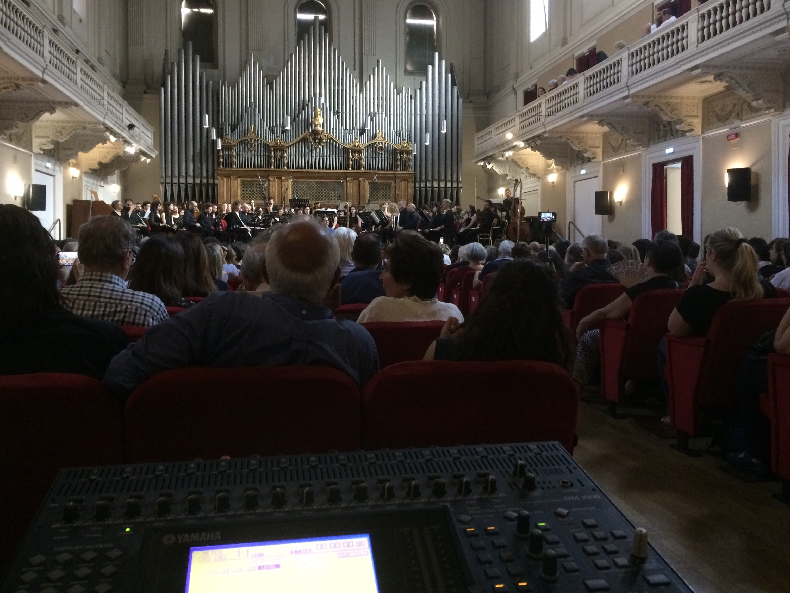

# Vademecum per gli studenti della Scuola di Musica Elettronica di Roma - Conservatorio Santa Cecilia

### Software

Utilizzo di software libero

- Github
- Editor di testo
- Editor audio
- Visualizzatore di spettro
- DAW

### Testi fondamentali

### Tools

- Il calendario delle lezioni SMERM
- La mailing list SMERM
- Slack

### Luoghi

La Scuola di Musica Elettronica di Roma del Conservatorio Santa Cecilia è situata al terzo piano della sede del Conservatorio in via dei Greci, 18

Le aule che lo studente utilizzerà maggiormente nel suo percorso di studi sono le seguenti:
- Aula 1 - Riccardo Bianchini

- Aula 2 - Franco Evangelisti

- Sala Accademica

## FAQs
- Cosa significa SMERM?
- Perche iscriversi?
- Come ci si iscrive al corso?
- Chi sono i docenti del corso?
- Dove si svolgono i corsi?
- Dove posso trovare i _piani di studio_?
- Come si svolgono le ammissioni?
- Quando si svolgono le ammissioni?
- A quanto ammonta la retta?
- A chi posso riferirmi per richiedere delle informazioni?

### Supporto

Per informazioni, dubbi o perplessità puoi contattarci su [slack](smerm.slack.com) al canale denominato #vademecum
